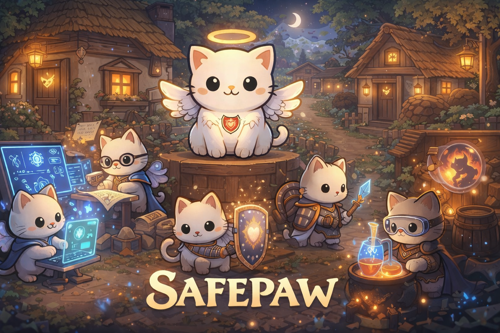
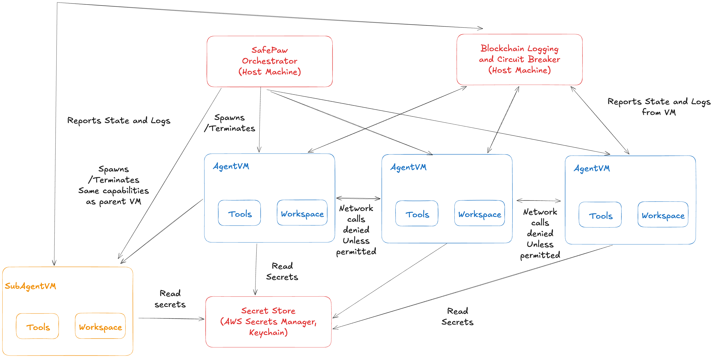

<div align="center">
  
</div>

# SafePaw - Agents for the Paranoid

SafePaw is a security focused agent orchestration layer.

## Design Philosophy
1. Agents are untrusted plugins, everything is treated with reasonable caution.
2. Strong isolation, no-access sandboxes as default, context is provided on a need to know basis for agents.
3. Verification and observability are key for active threat detection.
4. Useful and secure defaults without additional twiddling.

## Architecture
<div align="center">
  
</div>

1. SafePaw is a VM centric agentic orchestration system. Each agent runs on their own isolated VM instance via multipass.
It's designed as a multi-agent swarm system with strong context isolation between the instances and may be run across a network.

2. Each VM has different networking rights, access rights, and execution rights.

3. As each VM runs independently from a host, in the event a VM is behavior anomalously we can shutdown and circuit break the VM down if needed.

4. All logs are stored in a lightweight blockchain distributed across instances. This is for tamper resistant append-only logs. This prevents agents from hiding their trails by log deletion or log tampering.

5. Secrets are either stored via secure enclaves in the host machine or trusted 3rd party services like AWS secrets manager.

6. Context and workspace files are stored on the host machine and only selectively shared with the VMs as needed.

## Quickstart
1. Install [multipass](https://documentation.ubuntu.com/multipass/stable/how-to-guides/install-multipass/) this is needed to use the VMs required for safepaw

```bash
# MacOS
brew install multipass

# Debian/Ubunttu Linux
sudo snap install multipass

# Windows: check the link above
```

2. Install safepaw
```bash
make
```

## Testing
1. Run test suite using
```bash
make test

# Run rust tests
make test-rust

# Run solidity tests
make test-solidity
```

# Credits
1. [WebUI Assets -From : Sprout Lands -By : Cup Nooble](https://cupnooble.itch.io/sprout-lands-ui-pack)